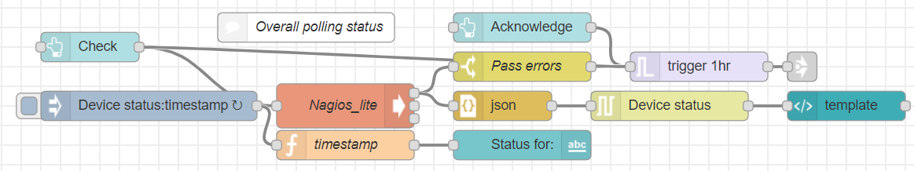
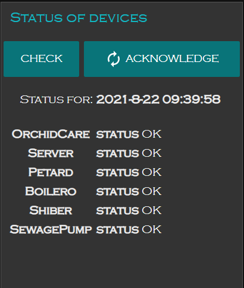

# Problem:
Rarely, very rarely, random device stops functioning. I discover that few days later when I need something from this or that device.

Typical solution is running Nagios. Nagios can execute list of "checks", keep and track the status of the checks, and alert/execute_some_code if the status passed defined threshold. Nagios is the beast :)

However, for a small network it's a mammoth in a crystal shop. It takes long ramp up to learn it, to configure and to make it working properly.
This is variant of Nagios which:

* Runs defined commands per every unit in the smart home and compares results with expected criteria.
* Puts all the results in InfluxDB (or other DB).
* In case of failure of a certain unit it sends email and/or IM (pushbullet, telegram, etc.)

# Installation:
1. Create a folder in your Raspbbery Pi. Copy the `nll.py` and `config.json` there.
2. Write your own commands for devices in the `config.json`, using given config as example. It's recommended to test every command and expected output straight on the Rapsberry Pi. Once the  `config.json` is ready, it's good practice to run `./nll/py` from command line and see if it returns statuses as expected. If not, edit the  `config.json` until desired result appears. If your checking command line is not 'one-liner' you might want to put all commands in a bash script and call it as one command.
3. Load the nr_flow.json content in your Node-RED. Connect the "virtual wire" node to your "messaging node" (to a node which sends you instant messages, emails, alerts, etc.)
4. Change execution path in the execution node accordingly the location of the nll.py.
5. Arrange the UI group into tour tabs and deploy.

# Usage:

- Normally nothing interesting happens. Checks run every hour. You can see last check date and time.
- When specific check fails you'll get a message (I get email + pushbullet + telegram). To avoid flooding of messages there is a trigger node, limited to 1 mesage/hour. You might change the limit according to your preference. When you fixed the problem, you might want to release for a moment the limit and check the network status. Click `Acknowledge` for that.
- For extra status report in a present moment clock `Check`.
- In cases you want to exclude a device from checking, copy the `config.json` aside, and then edit  `config.json` appropriately. All this can be done live, without stopping the Node-RED.

# Further steps to develop
- Add polling status to IndluxDB.
- Show the status on the charts.
- Make check more sophisticated, dependent.
